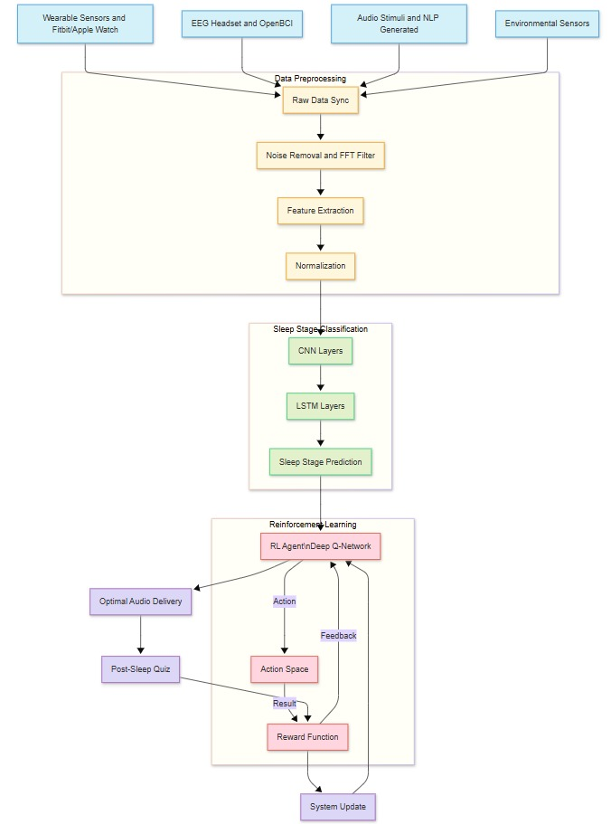

# 🧠 Subconscious Learning While Sleeping Using Machine Learning

This project explores an innovative intersection of **neuroscience, machine learning**, and **human cognition** by enabling **learning during sleep**. It leverages real-time EEG signal analysis, sleep stage detection, reinforcement learning (RL), and audio-based knowledge delivery to reinforce information **subconsciously** without disrupting natural sleep cycles.

---

## 🎯 Objective

The primary goal of this project is to develop an intelligent system that:

- Detects the optimal sleep stage (e.g., Light sleep) for learning
- Delivers curated educational content via audio using TTS
- Uses Reinforcement Learning to optimize **when** content is delivered
- Measures learning retention through post-sleep quizzes
- Provides a user-friendly GUI for interaction, data upload, and results

---

## 📌 Key Features

| Feature | Description |
|--------|-------------|
| 🧠 EEG Signal Processing | Processes real EEG signals to extract frequency bands |
| 💤 Sleep Stage Classification | Uses a hybrid CNN + LSTM model for detecting Light, Deep, and REM sleep |
| 🤖 RL-Based Content Timing | Q-Learning agent decides when to deliver content during sleep |
| 🔊 Audio Content Delivery | Text is converted to speech using offline TTS (pyttsx3) |
| 🧪 Retention Evaluation | Post-sleep quizzes assess how much was subconsciously retained |
| 🖥️ GUI with Streamlit | Interactive interface to manage inputs, predictions, and feedback |

---

## 🧬 System Architecture




---

## 🛠️ Technologies Used

- **Languages & Frameworks**: Python, TensorFlow/Keras, Streamlit
- **Libraries**: NumPy, Pandas, Scikit-learn, Pyttsx3, Matplotlib
- **ML Models**: Convolutional Neural Network (CNN), Long Short-Term Memory (LSTM), Q-learning
- **Deployment**: Local environment with optional cloud extension

---

## 📂 Project Structure

```

subconscious-learning/
├── data/                  # EEG samples and generated audio
├── gui/                   # Streamlit frontend
│   └── app.py
├── models/                # CNN + LSTM model definition
│   └── sleep\_stage\_model.py
├── rl\_agent/              # Q-learning reinforcement logic
│   └── agent.py
├── tts/                   # Text-to-speech conversion
│   └── speaker.py
├── utils/                 # EEG preprocessing tools
│   └── preprocessing.py
├── main.py                # Model testing and development
├── requirements.txt       # Python dependencies
└── README.md              # Project documentation

````

---

## 📁 Sample EEG File Format

Ensure your `.csv` file contains at least **100 EEG data points**:

```csv
timestamp,eeg_signal
0,0.22
1,0.18
2,0.24
...
````

---

## ▶️ Getting Started

### 🔧 Setup Instructions

1. **Clone the Repository**

   ```bash
   git clone https://github.com/Mohanrajx/subconscious-learningm
   cd subconscious-learningm
   ```

2. **Create Virtual Environment**

   ```bash
   python -m venv venv
   venv\Scripts\activate   # On Windows
   ```

3. **Install Requirements**

   ```bash
   pip install -r requirements.txt
   ```

4. **Run the Streamlit App**

   ```bash
   streamlit run gui/app.py
   ```

---

## 🧪 Testing the Full System

1. Upload EEG data via the GUI
2. System predicts sleep stage using ML
3. RL agent decides if learning content should be played
4. If “Play”, input learning text or select a topic
5. Audio is played using TTS
6. After playback, a quiz tests what the user retained
7. Quiz score is shown and can be used as reward feedback for RL

---

## 📊 Evaluation Metrics

| Component                  | Metric                               |
| -------------------------- | ------------------------------------ |
| Sleep Stage Classification | Accuracy, F1-Score, Confusion Matrix |
| RL Agent Effectiveness     | Retention Improvement Rate           |
| TTS Quality                | Subjective clarity (user-rated)      |
| Overall System             | Retention score post-sleep           |

---

## 📚 Academic References

* [Sleep Learning in Humans](https://www.nature.com/articles/s41539-019-0055-z) – Nature Partner Journals
* [EEG-Based Sleep Stage Classification](https://www.ncbi.nlm.nih.gov/pmc/articles/PMC10817107/)
* [Reinforcement Learning for Cognition](https://ccn.berkeley.edu/pdfs/papers/computation_and_cognition_AGEC.pdf)
* [Sleep-EDF Dataset](https://physionet.org/content/sleep-edf/1.0.0/)

---

## 👨‍💻 Authors

This project was developed by students of Kingston Engineering College:

* **G. Mohan Raj** – Project Lead
* Aravindhan R
* Jai Balaji R
* Manoj Prabu R
* Thamil Selvan M
* Varun Raj G

**GitHub Repo:** [https://github.com/Mohanrajx/subconscious-learning](https://github.com/Mohanrajx/subconscious-learningm)

---

## ⚠️ Disclaimer

This project is for **academic research and educational purposes** only. The system is a simulation and not yet clinically validated for real-world medical or therapeutic use.

---
